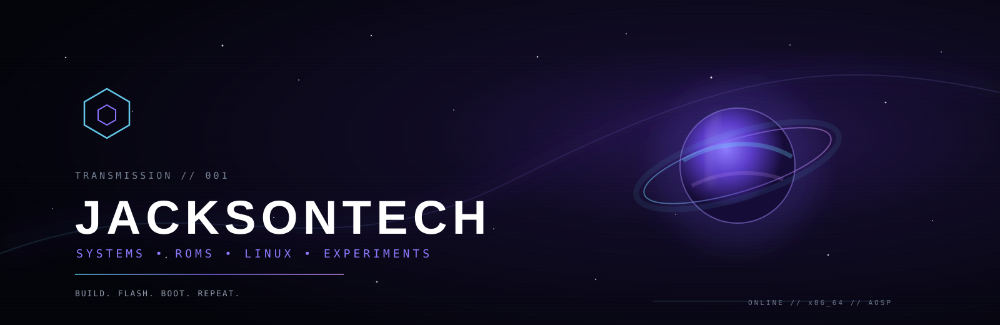

 

# JACKSONTECH

**Systems · ROMs · Linux · Experiments**

---

### ◈ SIGNAL

> Welcome to the **JacksonTech** sector.
>
> I build custom operating-system projects, Linux distributions, system tooling, and Android work — with older projects kept here as history.

**Current signal:** building **CathodeOS** — Android 16, x86_64, PC-focused, AOSP-based, with microG.

---

## ◉ ACTIVE SYSTEMS

<table>
<tr>
<td width="50%" valign="top">

### CATHODEOS

**Android for PCs.**

AOSP-based Android 16 bring-up for generic x86_64 laptops and desktops.

<pre>
ANDROID 16
x86_64
UEFI / PC
microG
CATHODEOS UI
</pre>

<a href="https://github.com/Jackson4Rocks/CathodeROM">→ Source: CathodeROM</a>

</td>
<td width="50%" valign="top">

### CALYPSO LINUX

**Linux with a pulse.**

An Arch-based desktop distribution built around a focused, polished workflow.

<pre>
ARCH BASE
KDE PLASMA
HYPRLAND
CUSTOM UX
OPEN SOURCE
</pre>

<a href="https://github.com/Jackson4Rocks/calypso-linux">→ Source: calypso-linux</a>

</td>
</tr>
<tr>
<td width="50%" valign="top">

### GALAXIAN

**ARCHIVED PROJECT.**

An older Android ROM/device project that is no longer maintained or actively developed.

<a href="https://github.com/Jackson4Rocks/crDroid-Galaxian">→ crDroid-Galaxian</a>

</td>
<td width="50%" valign="top">

### TAHOE

**CLOSED PROJECT.**

A previous recovery/low-level development project that has been discontinued.

<a href="https://github.com/Jackson4Rocks/tahoe-recovery">→ tahoe-recovery</a>

</td>
</tr>
</table>

---

## ◈ THE STACK

<code>AOSP</code> · <code>Android</code> · <code>Linux</code> · <code>x86_64</code> · <code>Hyprland</code> · <code>Shell</code> · <code>Git</code> · <code>UEFI</code>

---

## ◇ BUILD PHILOSOPHY

<pre>
       SOURCE
         │
         ▼
   ┌─────────────┐
   │   EXPLORE   │
   └──────┬──────┘
          │
          ▼
   ┌─────────────┐
   │   BUILD     │
   └──────┬──────┘
          │
          ▼
   ┌─────────────┐
   │    BOOT     │
   └──────┬──────┘
          │
          ▼
   ┌─────────────┐
   │    TUNE     │
   └──────┬──────┘
          │
          └──────────────► REPEAT
</pre>

I like projects where the layers are visible, the tooling is reproducible, and the machine stays understandable.

---

## ⟡ CURRENT MISSION

| System | Mission | State |
|---|---|---|
| **CathodeOS** | Android 16 → x86_64 PC OS | BRING-UP |
| **Calypso Linux** | Arch-based desktop distribution | ACTIVE |
| **Galaxian** | Archived Android ROM project | ARCHIVED |
| **Tahoe** | Closed recovery project | CLOSED |

---

## JACKSONTECH

**JacksonTech** is the umbrella identity used across my software and operating-system projects.

The work is maintained by **Leon Sony**.

<a href="https://github.com/Jackson4Rocks/CathodeROM"><b>CathodeOS</b></a>
&nbsp;&nbsp;•&nbsp;&nbsp;
<a href="https://github.com/Jackson4Rocks/calypso-linux"><b>Calypso Linux</b></a>
&nbsp;&nbsp;•&nbsp;&nbsp;
<a href="https://github.com/Jackson4Rocks?tab=repositories"><b>All repositories</b></a>

  

© 2026 JacksonTech · Maintained by Leon Sony

